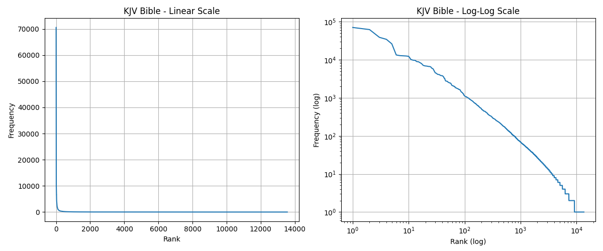
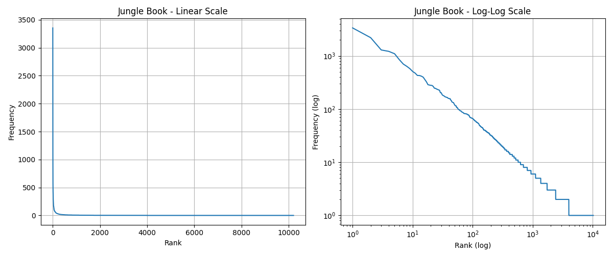
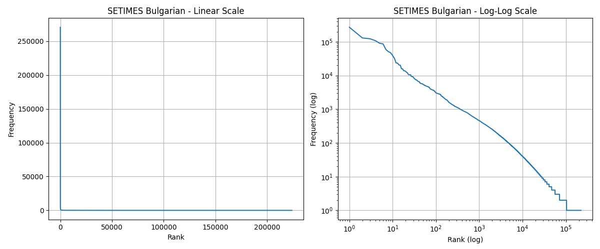

# N-gram Models Assignment Report

## Problem 1: Zipf's Law Analysis

### Methodology

I analyzed four different corpora to investigate Zipf's Law:
- King James Bible (English)
- The Jungle Book (English)
- SETIMES Bulgarian
- SETIMES Turkish

For each corpus, I counted word frequencies and sorted them by descending frequency. The tokenization was done by simply splitting on whitespace. I then created both linear and log-log plots to visualize the frequency distributions.

### Results

The plots are saved in `outputs/plots/`:
- `kjv_zipf.png` - King James Bible
- `junglebook_zipf.png` - The Jungle Book
- `setimes_bg_zipf.png` - SETIMES Bulgarian
- `setimes_tr_zipf.png` - SETIMES Turkish

### Discussion

Looking at the log-log plots, all four corpora show approximately linear trends, which confirms that Zipf's Law holds pretty well across different languages and text types. The log-log plots are mostly straight lines with a negative slope, which is what we'd expect from Zipf's Law.

Some observations:
- The SETIMES corpora have way more unique words (224k for Bulgarian, 264k for Turkish) compared to the English texts (13k for KJV, 10k for Jungle Book). This is probably because SETIMES is a much larger corpus and also because Bulgarian and Turkish might have more morphological variation.
- All corpora show the typical Zipf pattern where a few words appear very frequently (like "the", "and", "of" in English) and most words appear rarely.
- The linear plots show the characteristic hyperbolic curve that drops off quickly for lower ranks.

Overall, Zipf's Law seems to be a pretty universal property of natural language that works across different languages and text types.

---

## Problem 2: Random Text Generation

### Methodology

I implemented a "Dissociated Press" style text generator using n-gram models. I used the BasicNgram class provided in the assignment materials, which builds conditional probability distributions from a corpus. The system was trained on the King James Bible corpus and tested with n-gram sizes of 2, 3, and 4.

For text generation, I used Good-Turing smoothing to handle unseen n-grams better. The generation algorithm:
1. Starts with a random context from the trained model
2. At each step, samples the next word from the probability distribution given the current context
3. Updates the context by shifting the window (removing the first word and adding the new word)
4. Continues until 100 words are generated

### Generated Text Samples

#### N=2 (Bigrams)
Sample 1:
> took them in the first , Sheshai , and the timber also , and the LORD burnt he saith to me , apt to the LORD will even unto Amram , I am God and , and arise , of Assyria . And the king 's master unto me to the city wherein ye yourselves unto us together . And if the LORD your parents were baptized with the hand that is precious stone like oil . Hereby perceive that they have spoken . And he will I have put them , saith the LORD : ye will this people

#### N=3 (Trigrams)
Sample 1:
> man the truth 's sake , for the LORD delivered all their coasts , but made again of God . Therefore will he keep it . And Moses said , I shew the king of Judah . Whereupon he promised that he may stablish your hearts be humbled , and said , My God , come and take up all thy people pass over him : and she see his seed after him to the manner was , are an heritage , and the gift that Moses had said unto them , Do this now , I have commanded thee

#### N=4 (4-grams)
Sample 1:
> wise men are ashamed , they covered their heads . And his host , against Jerusalem , because they had transgressed against the God of Jacob ; Surely I will no more be a flood to destroy the wise men thereof were mighty . Wherefore Adonizedec king of Jerusalem , the chief of them . How precious also are thy thoughts unto me , O LORD , thou hast pleaded the causes of my soul into the hand of Naomi . Moreover Ruth the Moabitess , the wife of thy bosom , and shall serve them ; I will increase

### Discussion

The quality and coherence of the generated text clearly improves as n increases:

**N=2 (Bigrams)**: The text is quite random and choppy. It jumps between different topics and ideas very quickly. Phrases like "I am God and , and arise , of Assyria" show that the model has no memory of what came more than one word ago, leading to grammatically weird and semantically disconnected sequences.

**N=3 (Trigrams)**: There's noticeable improvement. The text has somewhat better local coherence - phrases like "the king of Judah" and "Moses had said unto them" feel more natural. However, the overall narrative still jumps around quite a bit, and longer-range coherence is missing.

**N=4 (4-grams)**: This produces surprisingly coherent text. Passages like "Wherefore Adonizedec king of Jerusalem" and "Moreover Ruth the Moabitess , the wife of thy bosom" are almost indistinguishable from actual biblical text. The model remembers 3 words of context, which is enough to maintain grammatical structure and some semantic continuity.

The trade-off is that higher n values make the text more "copied" from the original corpus - you can often recognize actual phrases from the Bible. Lower n values are more creative but less coherent. For this corpus size, n=4 seems to hit a sweet spot between coherence and variety.
